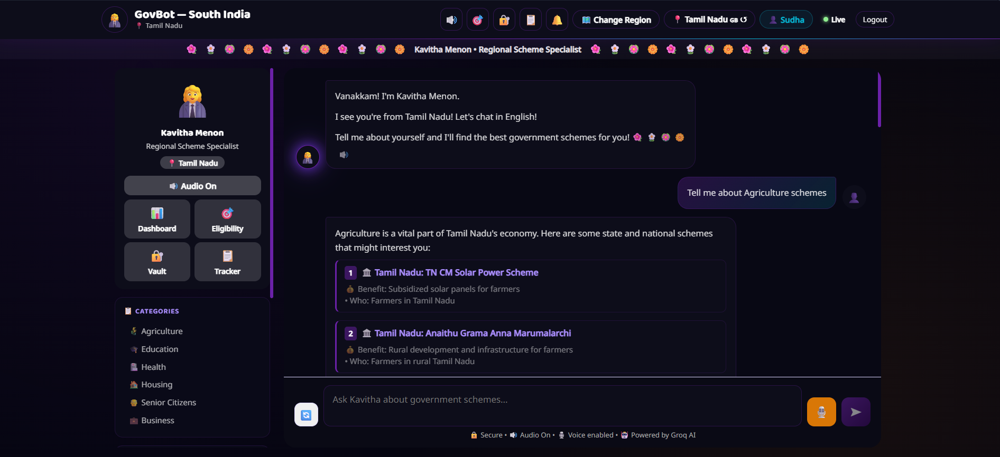
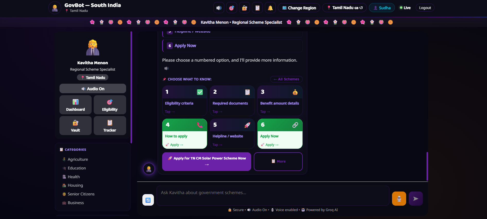
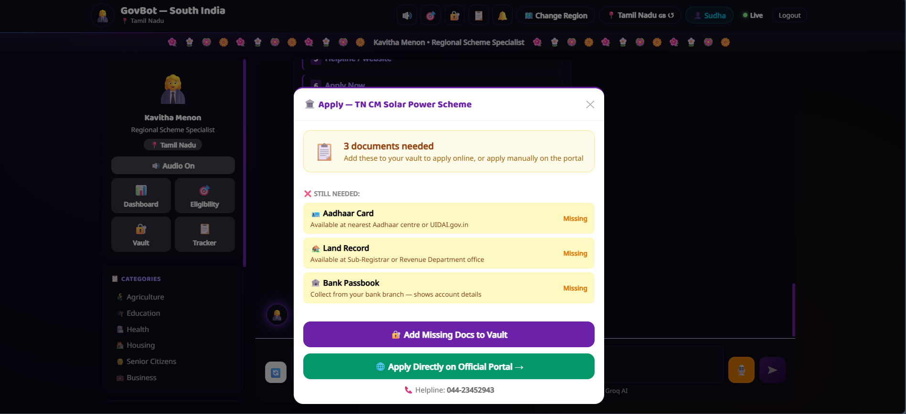
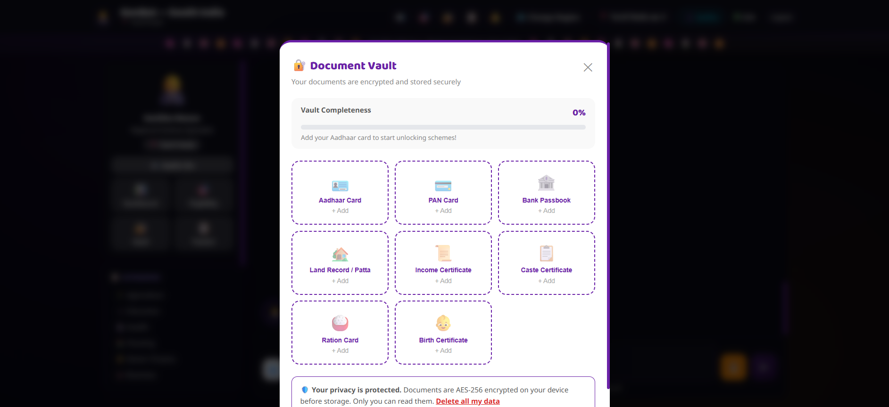
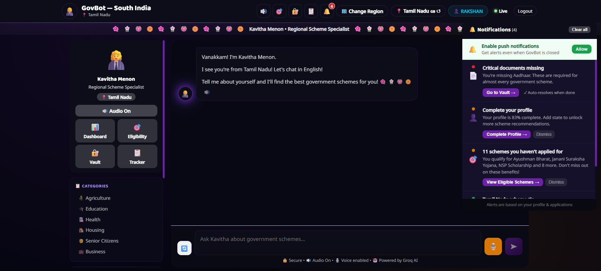
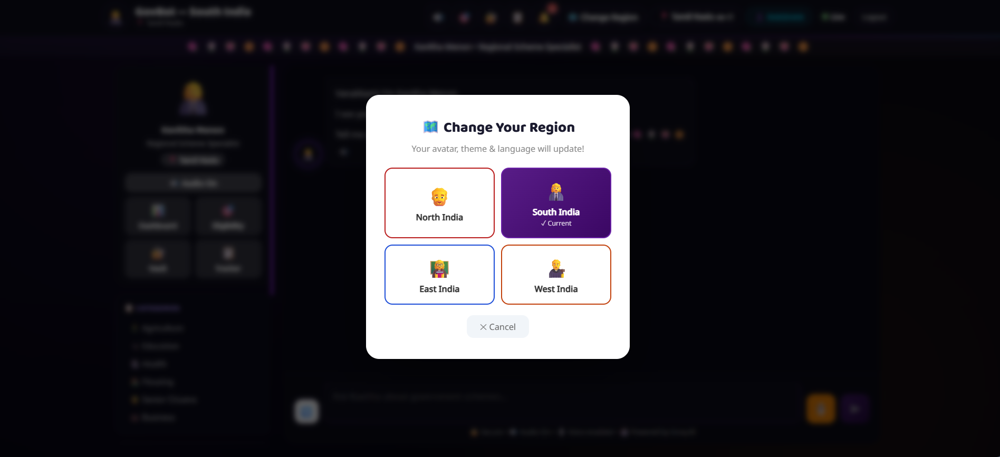
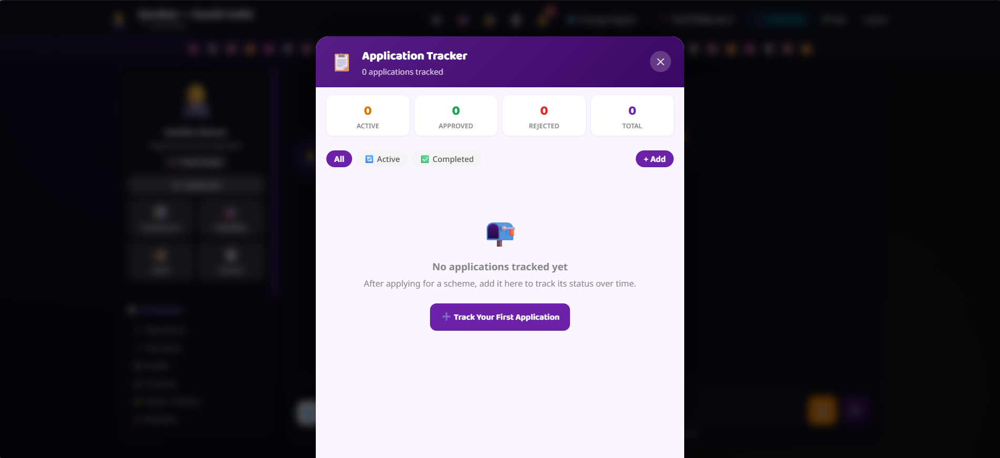
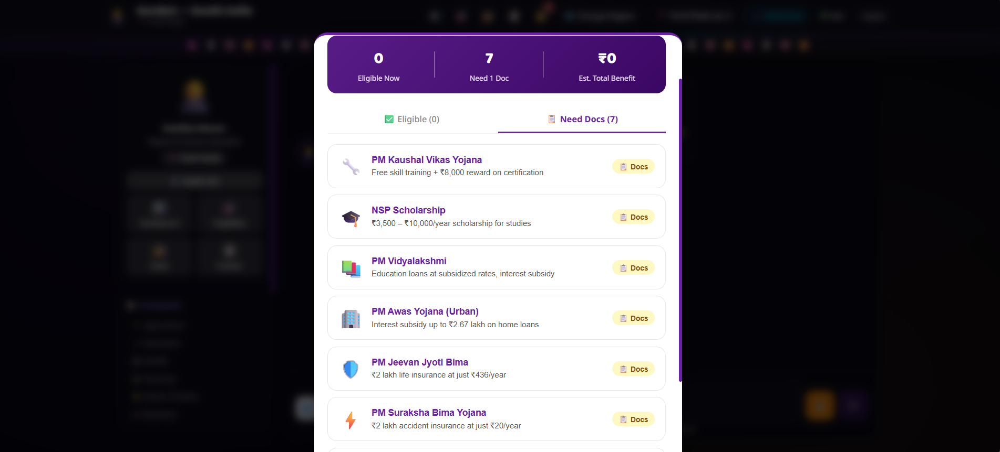
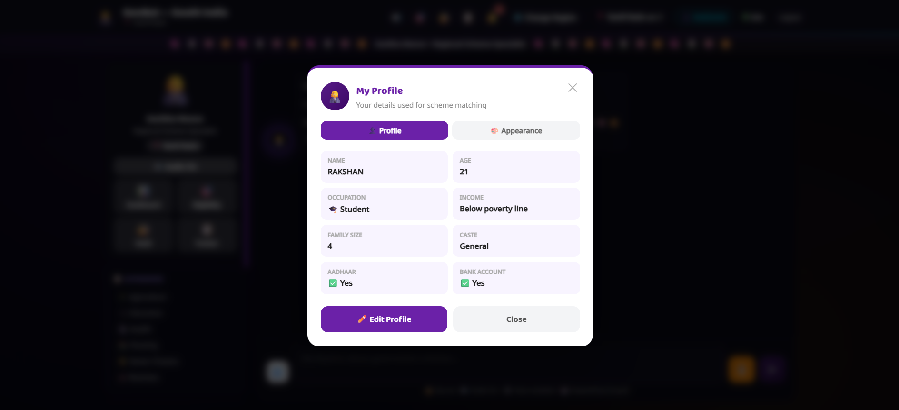
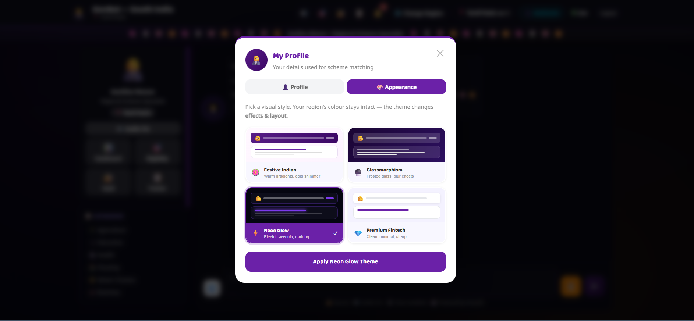

# 🇮🇳 GovBot India

> AI-powered chatbot that helps Indian citizens discover and apply for government schemes in their regional language.

---

## 📸 Screenshots

### 🤖 AI Chatbot — Ask About Any Scheme


### 📋 Scheme Menu — Explore Options Interactively


### 📝 Apply Flow — Document Checklist for Schemes


### 🔐 Document Vault — Secure Encrypted Storage


### 🔔 Notification Center — Smart Alerts & Reminders


### 🗺️ Change Region — Region-Based Personalization


### 📊 Application Tracker — Track Your Applications


### ✅ Eligibility Checker — Find Matching Schemes


### 👤 My Profile — Scheme Matching Details


### 🎨 Appearance — Choose Your Theme


---

## 🚀 Features

- 🤖 **AI Chatbot** — Powered by Groq (LLaMA 3.3 70B) to answer questions about government schemes
- 🌐 **Multilingual Support** — Tamil, Hindi, Telugu, Malayalam, Kannada, Bengali, Gujarati, English
- ✅ **Eligibility Checker** — Automatically matches user profile to qualifying schemes
- 📄 **Document Scanner (OCR)** — Scan and parse Aadhaar, income certificates, and more
- 🔐 **Document Vault** — AES-256 encrypted secure document storage
- 📊 **Application Tracker** — Track status of scheme applications (Active / Approved / Rejected)
- 🔔 **Notification Center** — Smart alerts for deadlines, missing docs, and eligible schemes
- 🗺️ **Region Selector** — North, South, East, West India with personalized avatars and themes
- 🎨 **Theme Engine** — Festive Indian, Glassmorphism, Neon Glow, Premium Fintech themes
- 🔊 **Voice Support** — Text-to-speech powered by Google TTS API

---

## 🛠️ Tech Stack

| Layer | Technology |
|-------|-----------|
| Frontend | React 18, Vite |
| Backend | Node.js, Express |
| AI | Groq API (LLaMA 3.3 70B) |
| Auth & DB | Firebase (Auth + Firestore) |
| OCR | Tesseract.js |
| TTS | Google TTS API |
| Encryption | AES-256 (crypto-js) |

---

## 📁 Project Structure

```
govbot/
├── govbot-backend/             # Node.js + Express API server
│   ├── server.js
│   ├── .env.example            # Environment variable template
│   └── package.json
└── govbot-frontend/            # React + Vite frontend
    ├── src/
    │   ├── App.jsx
    │   ├── firebase.js
    │   ├── Dashboard.jsx
    │   ├── AuthPage.jsx
    │   ├── DocumentVault.jsx
    │   ├── EligibilityReport.jsx
    │   ├── NotificationCenter.jsx
    │   ├── StatusTimeline.jsx
    │   └── utils/
    │       ├── crypto.js
    │       ├── eligibilityChecker.js
    │       ├── notificationEngine.js
    │       └── themeEngine.js
    ├── .env.example             # Environment variable template
    └── package.json
```

---

## ⚙️ Setup & Installation

### Prerequisites
- Node.js v18+
- A [Groq API key](https://console.groq.com)
- A [Firebase project](https://console.firebase.google.com)

---

### 1. Clone the repository

```bash
git clone https://github.com/koodalarasu/GovBot.git
cd GovBot
```

---

### 2. Backend Setup

```bash
cd govbot-backend
npm install
cp .env.example .env
```

Fill in your `.env`:
```env
GROQ_API_KEY=your_groq_api_key_here
PORT=5000
```

Start the backend:
```bash
node server.js
```

---

### 3. Frontend Setup

```bash
cd govbot-frontend
npm install
cp .env.example .env
```

Fill in your `.env` with your Firebase config:
```env
VITE_FIREBASE_API_KEY=your_firebase_api_key
VITE_FIREBASE_AUTH_DOMAIN=your_project.firebaseapp.com
VITE_FIREBASE_PROJECT_ID=your_project_id
VITE_FIREBASE_STORAGE_BUCKET=your_project.firebasestorage.app
VITE_FIREBASE_MESSAGING_SENDER_ID=your_sender_id
VITE_FIREBASE_APP_ID=your_app_id
VITE_FIREBASE_MEASUREMENT_ID=your_measurement_id
VITE_API_URL=http://localhost:5000
```

Start the frontend:
```bash
npm run dev
```

Open **http://localhost:3000** in your browser.

---

## 🔒 Environment Variables

This project uses `.env` files to keep API keys secure. **Never commit `.env` files to GitHub.**

Each folder has a `.env.example` file — copy it to `.env` and fill in your real values.

---

## 🌍 Deployment

| Service | Platform |
|---------|---------|
| Frontend | [Vercel](https://vercel.com) or [Netlify](https://netlify.com) |
| Backend | [Render](https://render.com) or [Railway](https://railway.app) |

After deploying the backend, update `VITE_API_URL` in your frontend environment settings to the live backend URL.

---

## 👨‍💻 Author

**Rakshan Velupillai**  
[GitHub](https://github.com/Rakshan-Velupillai) • [LinkedIn](https://www.linkedin.com/in/rakshan-velupillai-522b15276/)

---

## 📄 License

This project is open source and available under the [MIT License](LICENSE).
